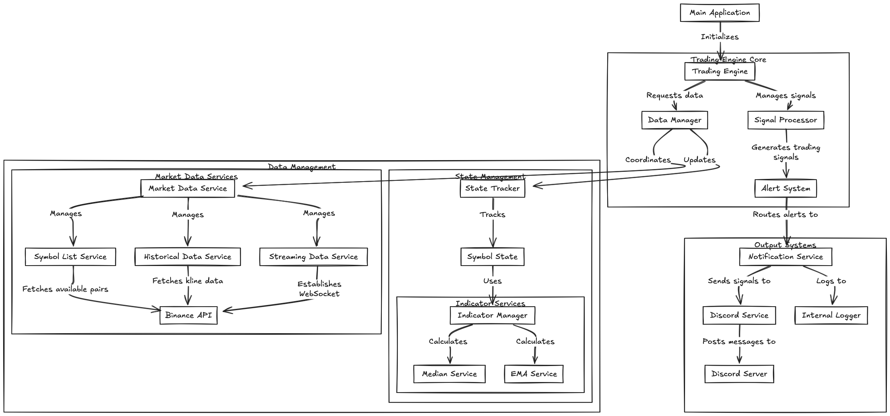
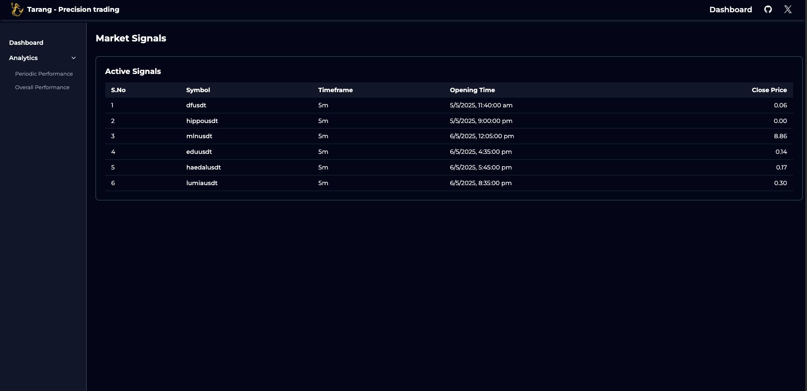
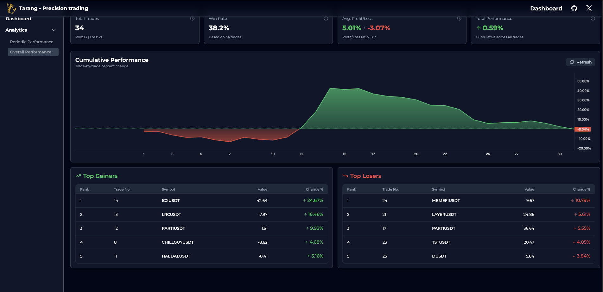
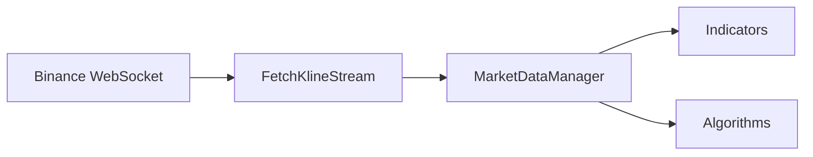
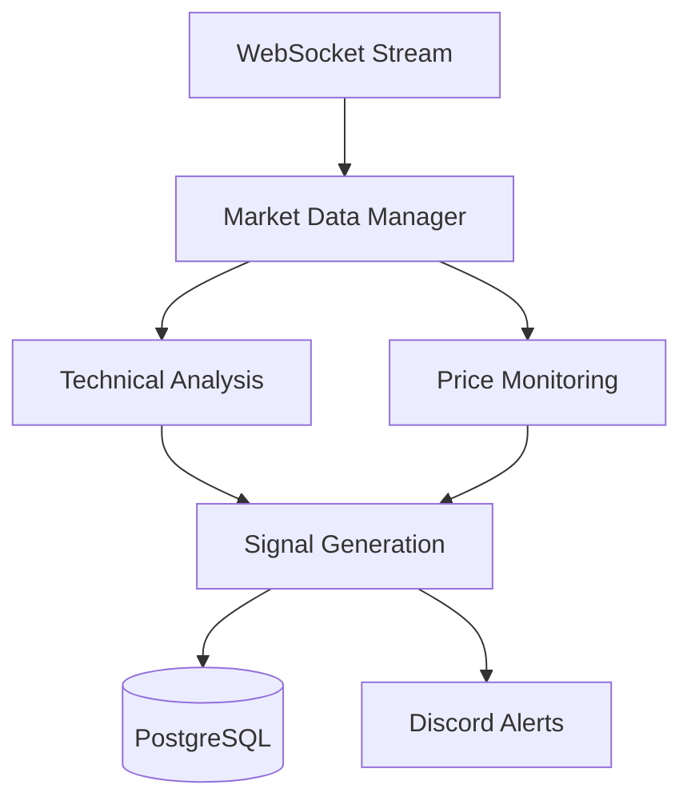

<h1 align="center">Tarang</h1>

<div align="center">
	<a href="https://tarang.ritik.dev/">Home</a>
  <span> • </span>
  <a href="https://tarang.ritik.dev/dashboard">Dashboard</a>
  <span> • </span>
  <a href="#">Docs (Coming soon)</a>
  <p></p>
</div>
<div align="center">

[](https://github.com/ritikx01/Tarang)
[](https://github.com/ritikx01/Tarang/issues)
[-@Wh15k3yTF-e6e6e6?style=flat-square&logo=twitter>)](https://x.com/Wh15k3yTF)
[](https://www.linkedin.com/in/ritikx01)

</div>

## About and History

<p>
• <strong>Tarang</strong> is my personal trading assisstant cum bot. This is specifically designed to catch altcoin price surge on various exchanges. Currently it is working off of Binance API.
</p>

<p>• During my crypto trading journey I noticed ocassionally that several altcoins surged quite a lot in price. I tried to trade those pairs but always entered very late and lost because I relied on 24H price change. To tackle this problem I tried to automate this process.</p>
<p>• Initially this project was meant to just send a notification during a price surge or a volatile move. Now it can open and close a trade by itself
</p>

View it's performance over at the [Dashboard](https://tarang.ritik.dev/dashboard/analytics/overall).

---

## 📊 Trade Initialization Criteria

The following metrics and indicators are used to evaluate trade entry and exit opportunities:

1. **Exponential Moving Averages (EMA)**  
   A combination of the 9, 21, and 100-period EMAs is used to assess trend direction and identify potential entry/exit points.

2. **Volume Surge Detection**  
   Trades are triggered when volume exceeds a dynamically calculated threshold based on the median volume of each trading pair.

3. **Average True Range (ATR)**  
   ATR is used as a volatility filter. A predefined threshold ensures trades only occur when market movement is sufficient.

4. **Distance Multiplier**  
   This metric evaluates whether the current candle’s close is significantly distant from the 100 EMA, relative to the average size of the previous _n_ candles. It acts as a momentum confirmation tool.

---

<div align="center">

## Architecture

</div>
This is a rough sketch of the initial project.  
The project is being updated continuously so this might be a bit outdated but easy to understand. It'll be updated very soon



<div align="center">

## Showcase

</div>
<b>Dashboard</b> - Active signals



<b>Overall Performance</b>


## Installation and running locally

You will need `npm`, `typescript` and `postgresql`.  
Clone this repo: `git clone https://github.com/ritikx01/Tarang.git`

### Backend

1. Go to backend directory `cd Tarang/backend`.
2. Install dependecies `npm install`.
3. Populate the `.env` with correct DB URL and other required configs.
4. Generate prisma client `npx prisma generate`.
5. Apply migrations `npx prisma migrate deploy`.
6. Compile the application `tsc`.
7. Run the backend `npm run start`.

#### Or you can run in docker container

The docker build file is included in the backend directory.

### Frontend

1. Go to the frontend directory `cd Tarang/frontend`.
2. Install the dependencies `npm install`.
3. Populate the `.env`.
4. Run the development server `npm run dev`
   Or
5. Compile the application `npm run build`.
6. Serve with your choice of server(nginx, apache) or deploy on cloud providers (netlify, vercel)
<div align="center">

## Backend breakdown

</div>
#### 1. Market Data Pipeline (`/data`)



- **WebSocket Manager** (`FetchKlineStream`)

  - Implements connection pooling with mutex locks
  - Automatic reconnection with exponential backoff
  - Batch processing for multi-symbol streams

- **Market Data Manager**
  - Singleton pattern for global state management
  - Real-time candlestick processing
  - Memory-efficient sliding window implementation
  - Plugin like indicator and filters implementation

#### 2. Technical Analysis Engine (`/indicators`, `/trackers`)

- **Indicator Framework**
  - EMA (9, 21, 100 periods)
  - ATR (Average True Range)
  - Dynamic indicator registry pattern
  - Efficient data structures using Priority Queues

#### 3. Signal Generation (`/services`, `/algorithmicStrats`)

- **Strategy Components**

  - Volume spike detection
  - EMA crossings
  - ATR-based volatility analysis
  - Price action multiplier analysis

- **Signal Management**
  - Batch processing with optimized DB writes (200 records/batch)
  - Cooldown mechanism to prevent signal clustering
  - Real-time performance tracking

#### 4. Performance Analytics

```typescript
interface PerformanceMetrics {
  interval: "D" | "W" | "M" | "Y";
  evaluation: EvalType.SMART | EvalType.NORMAL;
  aggregation: RuleStats;
}
```

- SMART evaluation system for trade outcomes
- Multi-timeframe analysis capability
- Batch aggregation for performance metrics

### Data Flow Architecture



### Optimization Techniques

1. **Memory Management**

   - Sliding window data structures
   - Batch processing for DB operations
   - Efficient indicator calculations

2. **Performance**

   - Connection pooling for WebSocket
   - Mutex locks for thread safety
   - Optimized data structures for real-time processing

3. **Reliability**
   - Structured error logging
   - Automatic WebSocket reconnection
   - Transaction management for DB operations

---

### Insights

> 💬 I uploaded this project to an LLM for review. Below are the conversation links with technical insights, critiques, and potential improvements.

- [Gemini review](https://aistudio.google.com/app/prompts?state={"ids":["1p1qOFo63Ufwr1A8efSTlAulEVGVNbcJJ"],"action":"open","userId":"116587489921489628172","resourceKeys":{}}&usp=sharing)
- [Grok review](https://grok.com/share/c2hhcmQtMg%3D%3D_0d2717d9-c387-489a-8c07-2bc7e7a89f0e)

---

## To-do

- [ ] Reduce Noise
- [ ] Add FAQ section
- [ ] Complete docs
- [ ] Add more Dashboard analytics
- [ ] Port to Go
